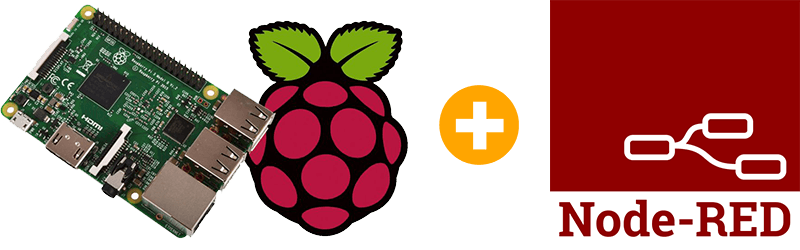

# Simple IOT project with Raspberry Pi and Nod-Red

## Introduction

### Raspberry Pi

The Raspberry Pi is a credit-card-sized computer that plugs into your TV and a keyboard. It is a capable little computer which can be used in electronics projects, and for many of the things that your desktop PC does, like spreadsheets, word processing, browsing the internet, and playing games. It also plays high-definition video