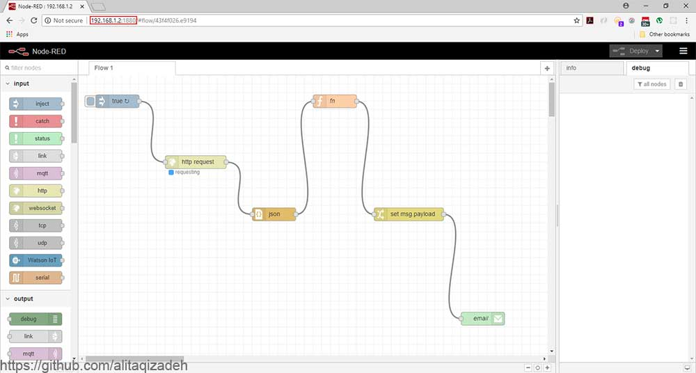
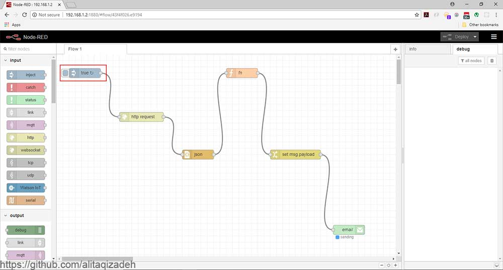
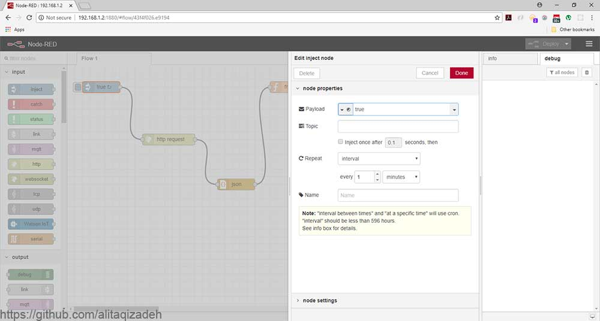
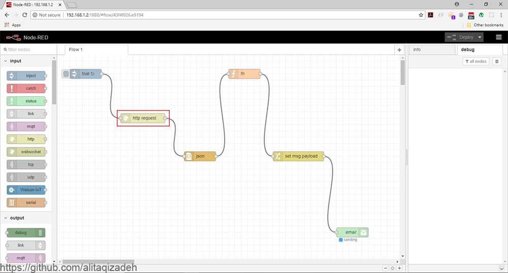
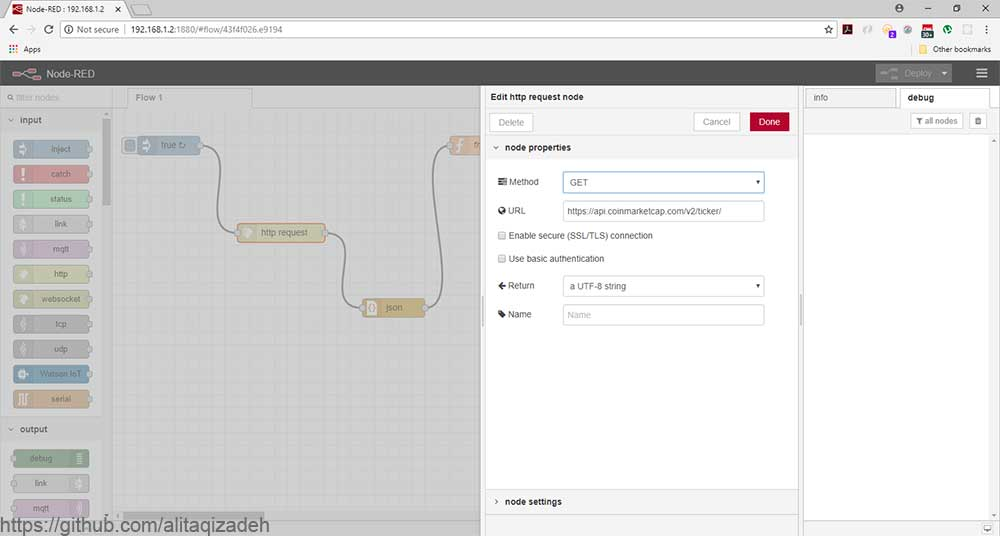

<p align="center"></p>

# Simple IOT project with Raspberry Pi and Nod-Red

## Introduction

### Raspberry Pi

The Raspberry Pi is a credit-card-sized computer that plugs into your TV and a keyboard. It is a capable little computer which can be used in electronics projects, and for many of the things that your desktop PC does, like spreadsheets, word processing, browsing the internet, and playing games. It also plays high-definition video.

### Nod-Red

Node-RED is a programming tool for wiring together hardware devices, APIs and online services in new and interesting ways.It provides a browser-based editor that makes it easy to wire together flows using the wide range of nodes in the palette that can be deployed to its runtime in a single-click.The light-weight runtime is built on Node.js, taking full advantage of its event-driven, non-blocking model. This makes it ideal to run at the edge of the network on low-cost hardware such as the Raspberry Pi as well as in the cloud.

### What do we want?

We want to get latest price of famous CryptoCurrencies and send it via email to users.

### Project steps

- We installed Raspberry Pi board and configured network before.

<p align="center"></p>

- From June 2018 Node-RED can be installed from the Pi Menu - Preferences - Recommended Software application installed on the Raspbian SD card image that can be downloaded from <a href="RaspberryPi.org">RaspberryPi.org<a>) otherwise We should connect to Raspberry pi with ssh and install Nod-Red on it so we can use this command:

```sh
bash <(curl -sL https://raw.githubusercontent.com/node-red/raspbian-deb-package/master/resources/update-nodejs-and-nodered)
```

- After the installation for using email module we should install it too. go to ~/.nod-red and run the following command:

```sh
npm i node-red-node-email
```

- Now we can run node-red with the following command:

```sh
node-red
```
<p align="center"></p>

- As you see at the image on top Nod-Red served on port 1880 so we can access Nod-Red from anywhere with the following address:

```sh
http://<Raspberry Pi IP adress>:1880
```

<p align="center"></p>

- We can now start our project. first of all we need to add a start point so add "Inject" module to our project and set the attribute "Payload" to true and for continuous job set attribute "Repeat" to interval.

<p align="center"></p>

<p align="center"></p>

-After that we want to get the informations of CryptoCurrencies. I used <a href="https://coinmarketcap.com/">CoinMarketCap</a> API. You should add "Http Request" module to your flow and set the address of the service you want to get informations.

<p align="center"></p>

<p align="center"></p>


